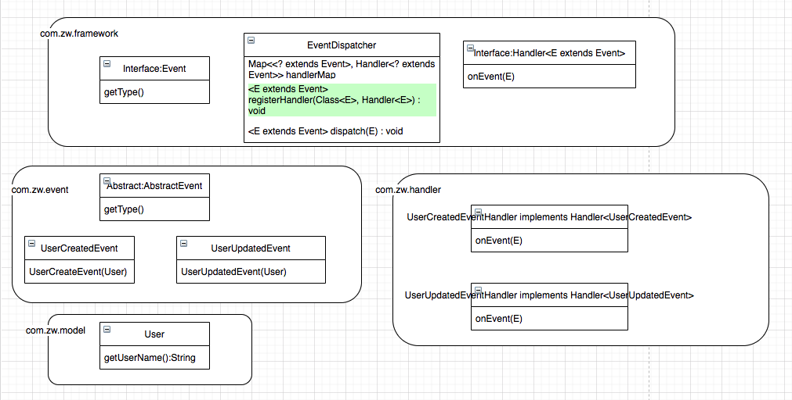

## Event Driven Architecture

### 1. key components

- event (Event.java)
- event state (UserCreatedevent.java, UserUpdatedEvent.java)
- producer (aka event emitters, EventDispatcher.java)
  - to detect, gather, and transfer events
  - need not to know consumers
- consumer (sinks, UserCreatedEventHandler.java, UserUpdatedEventHandler.java )
  - to react as soon as an event is presented
  - Alternatively, might just to filter, transform and forward the event to another component
- Event Channel
  - have the knowledge of the correct distribution of events

### 2. Class Diagram




### 3. Take-aways - Generics

- Benefits:

  - To write a sigle sort method that could sort the elements in an Integer array, a String array, or an array of any type that supports ordering
  - Also provide compile-time type safety

- Generic method

  - declare a type parameter section delimited by angle brackets and precedes the the method's return type

  - each type parameter section contains one or more type paramters separated by commas

    ```java
    public <E> void printArray (E[] inputArray){
      for (E element : inputArray) {
        System.out.printf("%s ", element);
      }
      System.out.println();
    }
    ```

  - Generic class

    ```java
    public class Box<T> {
      private T t;
      
      public void add(T t){
        this.t = t;
      }
      
      public T get(){
        return t;
      }
      
      public static void main(String[] args){
        
        Box<Integer> integerBox = new Box<>();
        Box<String> stringBox = new Box<>();
        
        integerBox.add(new Integer(10));
        stringBox.add(new String("Hello World"));
        
        System.out.printf("Integer Value :%d\n\n", integerBox.get());
        System.out.printf("String Value :%d\n\n", stringBox.get());
      }
    }
    ```


## Lazy Loading


## Leader/Followers


## Master-Worker


## Model View Controller


#### Producer Consumer


#### Queue Based Load Leveling